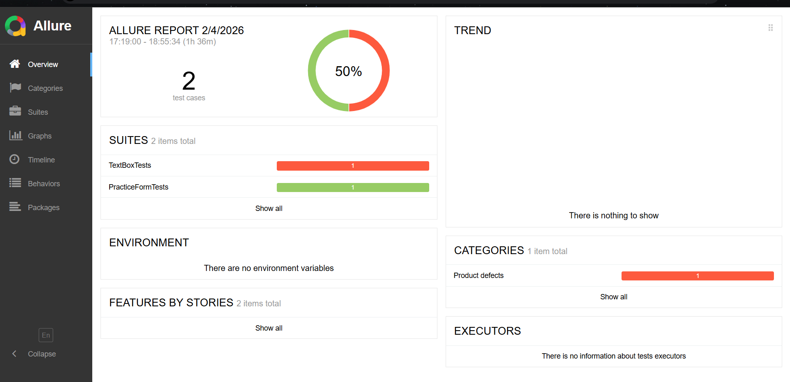

## 📋 Описание проекта

Автоматизированные **UI-тесты** для демо-сайта **DemoQA** (https://demoqa.com), реализованные с использованием фреймворка **Selenide** и системы отчётности **Allure Report**. Проект охватывает раздел **Elements → Text Box**, демонстрируя современный подход к UI-автоматизации: Page Object Model, централизованная настройка через базовый класс, автоматическая генерация шагов и вложений без ручных аннотаций.

## 🎯 Цели проекта

- Освоение **Selenide** как более удобной альтернативы Selenium WebDriver
- Практика паттерна **Page Object Model (POM)** для повышения поддерживаемости тестов
- Интеграция с **Allure Report** для автоматической визуализации шагов, скриншотов и HTML-кода страницы
- Получение профессионального отчёта, пригодного для демонстрации на собеседованиях и в команде
- Подготовка масштабируемой архитектуры для последующего расширения на другие разделы DemoQA

## 🛠️ Технологический стек

### Основные зависимости
- **Java 21** - язык программирования
- **Selenide 7.0.3** - фреймворк для автоматизации браузера (упрощённый Selenium)
- **JUnit 5.10.0** - фреймворк для запуска и управления тестами
- **Allure JUnit5 2.32.0** - интеграция с системой отчётности
- **Allure Selenide 2.32.0** - автоматический захват действий, скриншотов и исходного кода
- **Maven** - система сборки и управления зависимостями

## 📦 Структура проекта

\`\`\`
selenide-allure-demoqa/
├── src/
│   └── test/
│       ├── java/
│       │   ├── pages/
│       │   │   └── TextBoxPage.java     # Page Object для формы Text Box
│       │   └── tests/
│       │       ├── BaseTest.java        # Базовый класс с настройкой Selenide + Allure
│       │       └── TextBoxTests.java    # Тестовый класс
│       └── resources/
├── allure-results/                      # Автоматически генерируемые результаты Allure
├── allure-overview.png                  # Скриншот отчёта
├── pom.xml                              # Конфигурация Maven
└── README.md
\`\`\`

## 🚀 Быстрый старт

### Требования
- Java 21 или выше
- Maven 3.6+
- Allure CLI (установлен и добавлен в PATH)
- Google Chrome (установлен в системе)

### Установка и запуск

1. **Клонирование репозитория**
   \`\`\`bash
   git clone https://github.com/Andrewww555/selenide-allure-demoqa.git
   cd selenide-allure-demoqa
   \`\`\`

2. **Установка зависимостей**
   \`\`\`bash
   mvn clean install
   \`\`\`

3. **Запуск всех тестов**
   \`\`\`bash
   mvn test
   \`\`\`

4. **Генерация и просмотр отчёта Allure**
   \`\`\`bash
   allure serve allure-results
   \`\`\`

> 💡 Отчёт автоматически откроется в браузере на \`http://localhost:XXXX\`.

## 📊 Тестовые сценарии

### 1. Заполнение формы Text Box (\`fillFormTest\`)
Проверяет корректность отправки данных в форму:
1. Открытие страницы \`/text-box\`
2. Ввод полного имени (\`Full Name\`)
3. Ввод email-адреса
4. Ввод текущего адреса (\`Current Address\`)
5. Ввод постоянного адреса (\`Permanent Address\`)
6. Нажатие кнопки Submit
7. Проверка вывода результата в нижней части страницы

## 💡 Примеры кода

### Базовый тестовый класс
\`\`\`java
public abstract class BaseTest {
<<<<<<< HEAD
@BeforeAll
static void setUpAllureAndSelenide() {
Configuration.browserSize = "1920x1080";
Configuration.baseUrl = "https://demoqa.com";
=======
    @BeforeAll
    static void setUpAllureAndSelenide() {
        Configuration.browserSize = "1920x1080";
        Configuration.baseUrl = "https://demoqa.com";
>>>>>>> b64c78cfe83449b002f950b298fe1e91dcc79c38

        SelenideLogger.addListener("AllureSelenide", new AllureSelenide()
            .screenshots(true)
            .savePageSource(true)
        );
    }
}
\`\`\`

### Page Object для Text Box
\`\`\`java
public class TextBoxPage {
<<<<<<< HEAD
private final SelenideElement fullNameInput = $("#userName");
private final SelenideElement emailInput = $("#userEmail");
private final SelenideElement currentAddressTextarea = $("#currentAddress");
private final SelenideElement permanentAddressTextarea = $("#permanentAddress");
private final SelenideElement submitButton = $("#submit");
=======
    private final SelenideElement fullNameInput = $("#userName");
    private final SelenideElement emailInput = $("#userEmail");
    private final SelenideElement currentAddressTextarea = $("#currentAddress");
    private final SelenideElement permanentAddressTextarea = $("#permanentAddress");
    private final SelenideElement submitButton = $("#submit");
>>>>>>> b64c78cfe83449b002f950b298fe1e91dcc79c38

    public TextBoxPage fillFullName(String name) {
        fullNameInput.setValue(name);
        return this;
    }

    public TextBoxPage fillEmail(String email) {
        emailInput.setValue(email);
        return this;
    }

    public TextBoxPage fillCurrentAddress(String address) {
        currentAddressTextarea.setValue(address);
        return this;
    }

    public TextBoxPage fillPermanentAddress(String address) {
        permanentAddressTextarea.setValue(address);
        return this;
    }

    public TextBoxPage submit() {
        submitButton.click();
        return this;
    }

    public String getOutputName() {
        return $("#name").text();
    }
}
\`\`\`

### Тест с проверкой
\`\`\`java
@Test
void fillFormTest() {
<<<<<<< HEAD
new TextBoxPage()
.open("/text-box")
.fillFullName("Mr. Anderson")
.fillEmail("mr.anderson@example.com")
.fillCurrentAddress("Moscow")
.fillPermanentAddress("Perm")
.submit();
=======
    new TextBoxPage()
        .open("/text-box")
        .fillFullName("Mr. Anderson")
        .fillEmail("mr.anderson@example.com")
        .fillCurrentAddress("Moscow")
        .fillPermanentAddress("Perm")
        .submit();
>>>>>>> b64c78cfe83449b002f950b298fe1e91dcc79c38

    assertThat(new TextBoxPage().getOutputName())
        .isEqualTo("Name:Mr. Anderson");
}
\`\`\`

## 🔑 Преимущества использования Selenide + Allure

| Фича | Описание |
|------|----------|
| **Автоматические шаги** | Все действия (\`click\`, \`setValue\`, \`getText\`) попадают в Allure без \`@Step\` |
| **Скриншоты при падении** | При ошибке Allure автоматически прикрепляет \`.png\` и \`page-source.html\` |
| **Лаконичный синтаксис** | \`$()\` вместо \`driver.findElement(By.id(...))\` |
| **Цепочки вызовов** | Поддержка fluent interface: \`page.open().fill().submit()\` |
| **Стабильные локаторы** | Использование CSS-селекторов и \`data-*\` атрибутов |

## 📝 Best Practices

- **Page Object Model** - вынос элементов в отдельные классы для читаемости и поддержки
- **Базовый класс** - централизованная настройка окружения через \`BaseTest\`
- **Избегание ручных \@Step** - доверяйте автоматическому логгированию AllureSelenide
- **Обновление зависимостей** - используйте актуальные версии для стабильности скриншотов

## 🔧 Конфигурация проекта

### pom.xml
Основные настройки проекта:
\`\`\`xml
<properties>
<<<<<<< HEAD
<maven.compiler.source>21</maven.compiler.source>
<maven.compiler.target>21</maven.compiler.target>
<project.build.sourceEncoding>UTF-8</project.build.sourceEncoding>
=======
    <maven.compiler.source>21</maven.compiler.source>
    <maven.compiler.target>21</maven.compiler.target>
    <project.build.sourceEncoding>UTF-8</project.build.sourceEncoding>
>>>>>>> b64c78cfe83449b002f950b298fe1e91dcc79c38
</properties>

<dependencies>
    <dependency>
        <groupId>com.codeborne</groupId>
        <artifactId>selenide</artifactId>
        <version>7.0.3</version>
    </dependency>
    <dependency>
        <groupId>org.junit.jupiter</groupId>
        <artifactId>junit-jupiter-api</artifactId>
        <version>5.10.0</version>
        <scope>test</scope>
    </dependency>
    <dependency>
        <groupId>io.qameta.allure</groupId>
        <artifactId>allure-junit5</artifactId>
        <version>2.32.0</version>
        <scope>test</scope>
    </dependency>
    <dependency>
        <groupId>io.qameta.allure</groupId>
        <artifactId>allure-selenide</artifactId>
        <version>2.32.0</version>
        <scope>test</scope>
    </dependency>
</dependencies>
\`\`\`

## 📈 Планы по развитию

- [ ] Реализовать тесты для раздела **Practice Form**
- [ ] Добавить проверки для **Alerts** и **Browser Windows**
- [ ] Покрыть сценарии из **Interactions** (Drag and Drop, Sortable)
- [ ] Интеграция с **Jenkins** для CI/CD
- [ ] Настройка **GitHub Actions** как альтернативы Jenkins

## 📄 Лицензия

Этот проект распространяется под лицензией MIT.

## 🤝 Контакты

- **Автор**: Andrew
- **GitHub**: [@Andrewww555](https://github.com/Andrewww555)
